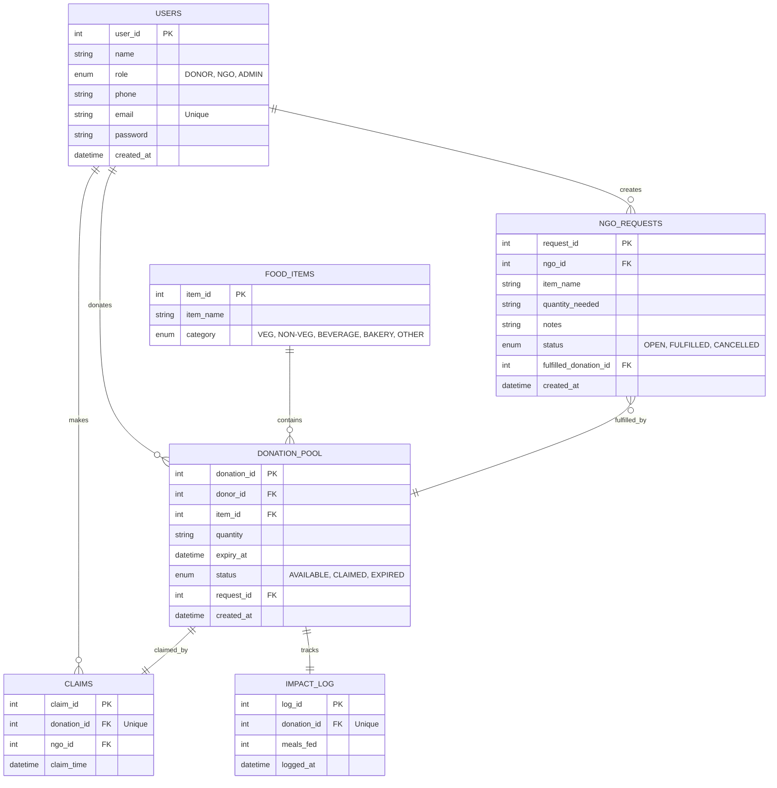

# Database Schema — FoodBridge

Complete documentation of the database structure, relationships, and normalization.

---

## 📊 Database Name

**`foodbridge_db`**

---

## 🗂️ Tables Overview

| Table | Purpose | Records |
|-------|---------|---------|
| Users | Stores both donors and NGOs | 4 |
| Food_Items | Catalogue of food types (avoids repetition) | 8 |
| Donation_Pool | **Core table** - all donations | 6 |
| Claims | Tracks which donations NGOs claimed | 1 |
| Impact_Log | Analytics - meals fed per donation | 1 |

---

## Table 1: Users

Stores both donors and NGOs in a single table with role discrimination.

### Schema

```sql
CREATE TABLE Users (
    user_id INT AUTO_INCREMENT PRIMARY KEY,
    name VARCHAR(100) NOT NULL,
    role ENUM('DONOR', 'NGO') NOT NULL,
    phone VARCHAR(15),
    email VARCHAR(100) UNIQUE NOT NULL,
    password VARCHAR(255) NOT NULL,
    created_at DATETIME DEFAULT CURRENT_TIMESTAMP
);
```

### Columns

| Column | Type | Constraints | Purpose |
|--------|------|-------------|---------|
| user_id | INT | PK, AUTO_INCREMENT | Unique user identifier |
| name | VARCHAR(100) | NOT NULL | Organization/Restaurant name |
| role | ENUM | NOT NULL | Either 'DONOR' or 'NGO' |
| phone | VARCHAR(15) | - | Contact number |
| email | VARCHAR(100) | UNIQUE, NOT NULL | Login identifier |
| password | VARCHAR(255) | NOT NULL | Plain-text (demo only; use hash in production) |
| created_at | DATETIME | DEFAULT NOW() | Timestamp of registration |

### Sample Data

```sql
INSERT INTO Users VALUES
(1, 'Hotel Saravana Bhavan', 'DONOR', '9876543210', 'saravana@donor.com', 'donor123', NOW()),
(2, 'Taj Residency Kitchen', 'DONOR', '9123456780', 'taj@donor.com', 'donor456', NOW()),
(3, 'Green Earth NGO', 'NGO', '9988776655', 'greenearth@ngo.com', 'ngo123', NOW()),
(4, 'Helping Hands Trust', 'NGO', '9001122334', 'helping@ngo.com', 'ngo456', NOW());
```

---

## Table 2: Food_Items

Separate table to avoid repetition of food item names (normalization).

### Schema

```sql
CREATE TABLE Food_Items (
    item_id INT AUTO_INCREMENT PRIMARY KEY,
    item_name VARCHAR(100) NOT NULL,
    category ENUM('VEG', 'NON-VEG', 'BEVERAGE', 'BAKERY', 'OTHER') NOT NULL
);
```

### Columns

| Column | Type | Constraints | Purpose |
|--------|------|-------------|---------|
| item_id | INT | PK, AUTO_INCREMENT | Unique food item identifier |
| item_name | VARCHAR(100) | NOT NULL | Name of the food (e.g., "Biryani") |
| category | ENUM | NOT NULL | Food category for filtering |

### Sample Data

```sql
INSERT INTO Food_Items VALUES
(1, 'Steamed Rice', 'VEG'),
(2, 'Sambar', 'VEG'),
(3, 'Grilled Chicken', 'NON-VEG'),
(4, 'Bread Loaves', 'BAKERY'),
(5, 'Vegetable Biryani', 'VEG'),
(6, 'Fruit Juice', 'BEVERAGE'),
(7, 'Dal Tadka', 'VEG'),
(8, 'Fish Curry', 'NON-VEG');
```

---

## Table 3: Donation_Pool ⭐

**The MOST IMPORTANT table** — contains all donations with status tracking.

### Schema

```sql
CREATE TABLE Donation_Pool (
    donation_id INT AUTO_INCREMENT PRIMARY KEY,
    donor_id INT NOT NULL,
    item_id INT NOT NULL,
    quantity VARCHAR(50) NOT NULL,
    expiry_at DATETIME NOT NULL,
    status ENUM('AVAILABLE', 'CLAIMED', 'EXPIRED') DEFAULT 'AVAILABLE',
    created_at DATETIME DEFAULT CURRENT_TIMESTAMP,
    FOREIGN KEY (donor_id) REFERENCES Users(user_id) ON DELETE CASCADE,
    FOREIGN KEY (item_id) REFERENCES Food_Items(item_id)
);
```

### Columns

| Column | Type | Constraints | Purpose |
|--------|------|-------------|---------|
| donation_id | INT | PK, AUTO_INCREMENT | Unique donation ID |
| donor_id | INT | FK → Users | Which donor made this donation |
| item_id | INT | FK → Food_Items | What food is being donated |
| quantity | VARCHAR(50) | NOT NULL | E.g., "5 kg", "20 portions" |
| expiry_at | DATETIME | NOT NULL | When food expires |
| status | ENUM | DEFAULT 'AVAILABLE' | Current status: AVAILABLE / CLAIMED / EXPIRED |
| created_at | DATETIME | DEFAULT NOW() | Timestamp of donation |

### Foreign Key Relationships

- **donor_id** → `Users.user_id` with `ON DELETE CASCADE`
  - If donor is deleted, all their donations are deleted
- **item_id** → `Food_Items.item_id`
  - Links to food catalogue

### Sample Data

```sql
INSERT INTO Donation_Pool VALUES
(1, 1, 1, '10 kg', DATE_ADD(NOW(), INTERVAL 4 HOUR), 'AVAILABLE', NOW()),
(2, 1, 2, '15 litres', DATE_ADD(NOW(), INTERVAL 3 HOUR), 'AVAILABLE', NOW()),
(3, 2, 3, '30 portions', DATE_ADD(NOW(), INTERVAL 5 HOUR), 'CLAIMED', NOW()),
(4, 2, 4, '50 loaves', DATE_ADD(NOW(), INTERVAL 2 HOUR), 'AVAILABLE', NOW()),
(5, 1, 5, '8 kg', DATE_ADD(NOW(), INTERVAL 6 HOUR), 'AVAILABLE', NOW()),
(6, 2, 7, '5 kg', DATE_ADD(NOW(), INTERVAL -1 HOUR), 'EXPIRED', NOW());
```

---

## Table 4: Claims

Tracks **which NGO claimed which donation** (one-to-one relationship).

### Schema

```sql
CREATE TABLE Claims (
    claim_id INT AUTO_INCREMENT PRIMARY KEY,
    donation_id INT NOT NULL UNIQUE,
    ngo_id INT NOT NULL,
    claim_time DATETIME DEFAULT CURRENT_TIMESTAMP,
    FOREIGN KEY (donation_id) REFERENCES Donation_Pool(donation_id) ON DELETE CASCADE,
    FOREIGN KEY (ngo_id) REFERENCES Users(user_id) ON DELETE CASCADE
);
```

### Columns

| Column | Type | Constraints | Purpose |
|--------|------|-------------|---------|
| claim_id | INT | PK, AUTO_INCREMENT | Unique claim ID |
| donation_id | INT | FK, UNIQUE | Which donation was claimed (1-to-1) |
| ngo_id | INT | FK → Users | Which NGO claimed it |
| claim_time | DATETIME | DEFAULT NOW() | When the claim was made |

### Key Constraint: UNIQUE on donation_id

Each donation can be claimed by **at most one NGO**.

Prevents: Multiple NGOs claiming the same donation.

### Sample Data

```sql
INSERT INTO Claims VALUES
(1, 3, 3, NOW());  -- Green Earth NGO (user_id=3) claimed donation_id=3
```

---

## Table 5: Impact_Log

Tracks **impact metrics** — how many meals were fed from each donation.

### Schema

```sql
CREATE TABLE Impact_Log (
    log_id INT AUTO_INCREMENT PRIMARY KEY,
    donation_id INT NOT NULL UNIQUE,
    meals_fed INT NOT NULL,
    logged_at DATETIME DEFAULT CURRENT_TIMESTAMP,
    FOREIGN KEY (donation_id) REFERENCES Donation_Pool(donation_id) ON DELETE CASCADE
);
```

### Columns

| Column | Type | Constraints | Purpose |
|--------|------|-------------|---------|
| log_id | INT | PK, AUTO_INCREMENT | Unique log ID |
| donation_id | INT | FK, UNIQUE | Which donation this log is for (1-to-1) |
| meals_fed | INT | NOT NULL | Number of meals distributed |
| logged_at | DATETIME | DEFAULT NOW() | When the impact was logged |

### Calculation Logic

**Meals fed = quantity (all digits) × 2**

Example:
- Donation quantity: "5 kg" → Extract 5 → 5 × 2 = **10 meals**
- Donation quantity: "30 portions" → Extract 30 → 30 × 2 = **60 meals**

### Sample Data

```sql
INSERT INTO Impact_Log VALUES
(1, 3, 60, NOW());  -- Donation 3 fed 60 meals
```

---

## 🔗 Relationships Diagram



---

## 🎯 Normalization

### 1NF (First Normal Form)
- ✅ All attributes are atomic (no repeating groups)
- ✅ No multi-valued attributes
- Example: `quantity` is stored as text "5 kg", not as separate columns

### 2NF (Second Normal Form)
- ✅ Satisfies 1NF
- ✅ No partial dependencies
- ✅ `Food_Items` separated to avoid repeating item names
- Example: Instead of storing item_name in every donation, reference item_id

### 3NF (Third Normal Form)
- ✅ Satisfies 2NF
- ✅ No transitive dependencies
- ✅ No non-key attributes depend on other non-key attributes
- Example: Donor name is in Users, not in Donation_Pool

---

## 🔒 Constraints & Integrity

| Constraint | Purpose |
|-----------|---------|
| PRIMARY KEY | Ensures each record is unique |
| UNIQUE | email in Users, donation_id in Claims |
| NOT NULL | Ensures required data is always present |
| AUTO_INCREMENT | Generates unique sequential IDs |
| FOREIGN KEY | Maintains referential integrity |
| ON DELETE CASCADE | Clean deletion (delete user → delete donations) |
| ENUM | Restricts values to predefined set (AVAILABLE/CLAIMED/EXPIRED) |

---

## 📋 Sample Data Summary

| Table | Count | Purpose |
|-------|-------|---------|
| Users | 4 | 2 Donors + 2 NGOs |
| Food_Items | 8 | Pre-populated catalogue |
| Donation_Pool | 6 | Various statuses (AVAILABLE, CLAIMED, EXPIRED) |
| Claims | 1 | One claim already made |
| Impact_Log | 1 | 60 meals fed from one donation |

---

## 🔍 Key Insights

1. **Donation_Pool is the core** — all other tables reference it
2. **One claim per donation** — UNIQUE constraint on donation_id
3. **Cascade delete** — Deleting a user deletes all their donations
4. **Separate Food_Items** — Avoids duplication and allows categorization
5. **Status tracking** — AVAILABLE → CLAIMED → EXPIRED (lifecycle)

---

## 📊 View Sample Data

To see all data in MySQL:

```sql
SELECT * FROM Users;
SELECT * FROM Food_Items;
SELECT * FROM Donation_Pool;
SELECT * FROM Claims;
SELECT * FROM Impact_Log;
```

To see relationships:

```sql
SELECT 
    dp.donation_id, 
    u.name AS donor_name, 
    fi.item_name, 
    dp.quantity, 
    dp.status
FROM Donation_Pool dp
JOIN Users u ON dp.donor_id = u.user_id
JOIN Food_Items fi ON dp.item_id = fi.item_id;
```
